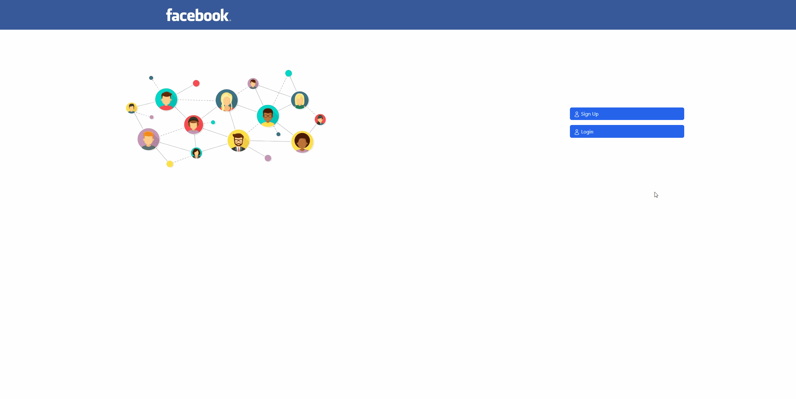

# Projet Facebook Graph.QL

## Description

### Lancer le projet :

1. Installer et démarrer le Back-End (Server) :
[Documentation Back-End](Back-End/README.md)

2. Installer et démarrer le Front-End (Client) :
[Documentation Front-End](Front-End/README.md)

## Tâches

### Authentification des Utilisateurs
- [x] Inscription et connexion avec validation
- [x] Gestion des sessions utilisateur
- [x] Déconnexion
- [x] Renvoie d'erreurs en cas de mauvaise authentification

### Gestion des Articles
- [x] Création d'articles
- [x] Lecture d'articles
- [x] Mise à jour d'articles
- [x] Suppression d'articles
- [x] Affichage de l'auteur des articles
- [x] Affichage du contenu des articles
- [x] Affichage des commentaires des articles
- [x] Affichage des likes des articles

### Interaction avec les Articles
- [x] Possibilité pour les utilisateurs de commenter les articles
- [x] Système de "like" pour les articles

### Navigation et Filtrage
- [x] Vue d'ensemble des derniers articles sur la page principale
- [x] Filtrer les articles par auteur
- [x] Filtrer les articles par popularité (ascendant/descendant nombre de likes)

## Demo

